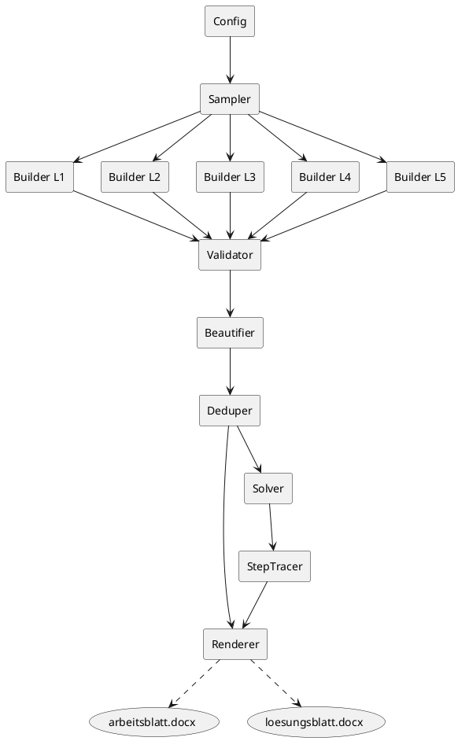

# SPEC-1-Gleichungs-Generator

Version: 1.0 (2025-09-11)

## Background

Für Teilnehmende soll ein automatischer Generator lineare Gleichungen **mit genau einer Unbekannten x** erzeugen. Die Aufgaben decken einen **steigenden Schwierigkeitsgrad** ab – von einfachen Umformungen bis zu komplexen Bruchgleichungen. Ziel ist es, **lösbare**, teils **optisch unübersichtliche** Aufgaben zu erstellen, deren **Lösungen häufig als Brüche** enden. Zusätzlich wird ein **Arbeitsblatt (ohne Lösungen)** und ein **Lösungsblatt (mit Rechenweg)** als **.docx** ausgegeben.

## Requirements (MoSCoW)

### Must-have

* Nur **eine Variable x** pro Aufgabe; jede Gleichung **eindeutig lösbar** (keine Division durch 0, keine Widersprüche, keine Identitäten ohne eindeutige Lösung).
* **5 Schwierigkeitslevel**:

  1. **Einfach**: x nur auf **einer Seite** (z. B. `3x-7=12`, `5-2x=17`, `23=7+2x`).
  2. **Beide Seiten**: `ax+b = dx+e`.
  3. **Eine Klammer**: je 2× **+**, **–**, **×** vor der Klammer (× auch implizit).
  4. **Gemischte Klammern**: Kombinationen aus +/–/× und mehreren Klammern.
  5. **Bruchgleichungen**: von einfach (`(1/2)x=5`) bis schwer (verschachtelte Produkte/Quotienten).
* **Lösungen bevorzugt als Brüche** (kein Dezimalzwang); Rechenweg im Lösungsblatt **schrittweise** nachvollziehbar.
* **Word-Export**: Zwei Dateien `.docx`: Arbeitsblatt (Aufgaben, mit Leerraum), Lösungsblatt (nummerierte Lösungen + Rechenweg).
* **DOCX-Gleichungen**: Darstellung erfolgt aktuell als reiner Text (`python-docx`). Ein optionaler Renderer für native Word-Formeln (OMML/MathML) kann später ergänzt werden.
* **Sprache**: Deutsch (Aufgaben & Rechenwege).

### Should-have

* **Verteilung (Standard)**: L1=4, L2=4, L3=6, L4=4, L5=5 ⇒ **gesamt 23 Aufgaben**.
* **Parametrisierbare Anzahl** pro Level; globaler **Zufallssamen** (reprozierbare Sätze).
* **Bruchdarstellung** optional als **unechter Bruch** oder **gemischte Zahl**.
* **Genügend Abstand** zwischen Aufgaben (z. B. 4–6 leere Zeilen oder Absatzabstände in `docx`).

### Could-have

* Optionale **Seitenköpfe/‑füße** (Titel, Level-Abschnitte, Datum, Logo).
* Optionale **Aufgaben-IDs** oder QR-Code mit Lösungsschlüssel.

### Won’t-have (v1)

* Keine Nichtlinearitäten, keine Potenzen/Quadrate, keine Systeme.
* Kein PDF-Export (nur `.docx`).
* Keine grafischen Lösungshilfen.

## Method

### Architektur & Komponenten

* **Config**: Parameter (Anzahl pro Level, Zahlenbereiche, Ziel‑Bruchhäufigkeit, `visual_complexity`, Zufallssamen).
* **Sampler**: zieht eine Ziel‑Lösung r = p/q als Rationalzahl (bevorzugt Nicht‑Ganzzahl), um gezielt Aufgaben zu konstruieren, die auf x = r führen.
* **Builder L1…L5**: Vorlagen/Algorithmen je Level, die Terme so zusammensetzen, dass nach Vereinfachung eine lineare Gleichung entsteht und x = r die Lösung ist.
* **Validator**: prüft Eindeutigkeit (kein Koeffizient 0, keine Identität), Definitionsmenge (Nenner ≠ 0), kein Verbot schwacher Formen.
* **Beautifier**: setzt Formatpräferenzen (implizites Mal „2x“, Klammerstile, Minus vor Klammer). Gesteuert durch `visual_complexity` = "clean"|"mixed".
* **Solver + StepTracer**: löst mit SymPy und erzeugt Schritt‑für‑Schritt‑Rechenwege (Klammern auflösen → auf eine Seite bringen → zusammenfassen → durch Koeffizienten teilen; bei Brüchen zusätzlich Hauptnenner bilden, Ausschlusswerte nennen).
* **Deduper**: erkennt Duplikate per kanonischer Form (normalisierte Gleichung & Lösung) und verwirft Wiederholungen.
* **Renderer (DOCX)**: erstellt `arbeitsblatt.docx` (nur Aufgaben, mit Abstand) & `loesungsblatt.docx` (nummerierte Lösungen + Rechenweg).



### Datenmodell (Python‑Strukturen)

* `Equation`: `{ id, level, sympy_eq: Eq, text: str, solution: Rational, excluded: set, template: str, params: dict }`
* `SolveStep`: `{ description_de: str, lhs: Expr, rhs: Expr }`
* `Problem`: `{ equation: Equation, steps: List[SolveStep] }`

### Ziel‑Lösungs‑Sampler (Bruchfokus)

1. Ziehe zufällig p ∈ \[−12, 12] \ {0}, q ∈ \[2, 12].
2. Setze r = Rational(p, q). Mit Wahrscheinlichkeit α (z. B. 0.8) erzwinge Nicht‑Ganzzahl (falls q p teilt, neu ziehen).

### Builder‑Strategien (je Level)

**Level 1 (x auf einer Seite)**

* Muster: `ax + b = c` oder `a − bx = c` oder `c = d + ex`.
* Vorgehen: Ziehe a ≠ 0, b, c zufällig; erzwinge c = a·r + b (bzw. analog), damit Lösung r ist.
* Variation: Zufällig linke/rechte Seite vertauschen; Vorzeichen von a, b mischen.

**Level 2 (x auf beiden Seiten)**

* Muster: `ax + b = dx + e`.
* Ziehe a ≠ d für eindeutige Lösung.
* Setze z. B. b = d·r + e − a·r.
* Parameter a, d, e zufällig, dann b berechnen.
* Prüfe |a − d| nicht zu klein (zur Schrittvielfalt; optional Normierung auf positiven x‑Koeffizienten).

**Level 3 (eine Klammer)**

* Muster (+): `k + (mx + n) = px + q`.
* Muster (−): `k − (mx + n) = px + q`.
* Muster (× implizit): `t(mx + n) = px + q`.
* Vorgehen: Wähle k, m, n, t, p, q zufällig und erzwinge Gleichung so, dass x = r erfüllt ist (z. B. p·r + q = k + (m·r + n)).
* `visual_complexity="mixed"`: häufiger implizites Mal (`13(2x−7)`).

**Level 4 (gemischte Klammern)**

* Muster: `a(mx+n) + b − (cx+d) = p − (qx+r) + s(tx+u)`.
* Vorgehen: Werte beidseitig bei x = r gleichsetzen und dann eine Konstantenvariable (z. B. u) auflösen, damit die Bedingung exakt stimmt.
* Sicherstellen, dass nach Expandieren linear bleibt und x‑Koeffizient ≠ 0.

**Level 5 (Bruchgleichungen)**

* Einfach: `(a/b)·x = c` ⇒ r = (b·c)/a oder umgekehrt c = (a/b)·r.
* Mittel: `(ux+v)/w = y` oder Summe mehrerer Brüche mit Hauptnenner.
* Anspruchsvoll (lineare Bruchterme beidseitig):
  Konstruiere
  (a1·(m x + n) + c1) / (d1·(c x + d)) = (a2·(M x + N) + c2) / (d2·(C x + D))

  Kreuzmultiplizieren ergibt linear:
  d2·a1·(m x + n) + d2·c1 = d1·a2·(M x + N) + d1·c2.
  Wähle alle Parameter zufällig, löse nach einem (z. B. c2) so, dass x = r Lösung ist; prüfe Nenner ≠ 0 bei x = r und x‑Koeffizient ≠ 0.

### Validierung & Duplikatkontrolle

* Eindeutigkeit: Nach Expand/Collect muss Gleichung A·x + B = 0 mit A ≠ 0 ergeben.
* Domäne: Für alle Nennerterme Liste der Ausschlusswerte (z. B. 2x − 3 ≠ 0 ⇒ x ≠ 3/2).
* Bruchquote: Erzwinge Anteil β (z. B. 70–90 %) nicht‑ganzzahliger r; notfalls neu sampeln.
* Kanonische Form: `sympy.together() → expand() → collect(x) → Eq(lhs, rhs)`; String‑Hash in Set speichern.

### StepTracer (Rechenweg‑Heuristik)

1. Klammern auflösen (`expand`).
2. Brüche beseitigen: mit Hauptnenner multiplizieren; Ausschlusswerte explizit notieren.
3. x‑Terme auf eine Seite, Konstanten auf die andere.
4. Zusammenfassen (`collect(x)`), ggf. mit −1 multiplizieren, um führenden Koeffizienten positiv zu machen.
5. Durch Koeffizienten teilen und als Rational formatiert ausgeben; optional zusätzlich gemischte Zahl.

### DOCX‑Ausgabe

* **Arbeitsblatt**: Level‑Überschriften, dann nummerierte Aufgaben. Nach jeder Aufgabe Absatzabstand (z. B. 24–36 pt × 4–6 Zeilen) + optional Leerzeilen.
* **Lösungsblatt**: gleiche Nummerierung; unter jeder Aufgabe Schrittfolge als Liste.
* Typografie: Standard‑Schrift (z. B. Calibri 12), Monospace für Terme optional. Seitenränder 2–2.5 cm.

### Konfiguration (Beispiel)

```yaml
counts: { L1: 4, L2: 4, L3: 6, L4: 4, L5: 5 }
coeff_range: { min: -12, max: 12 }
denom_range: { min: 2, max: 12 }
prefer_fraction: 0.85   # Anteil nicht-ganzzahliger Lösungen
visual_complexity: mixed # oder "clean"
seed: 12345
format: { mixed_number: false }
```

## Changelog

* **1.0 (2025-09-11)** – Erste veröffentlichte Spezifikation.
