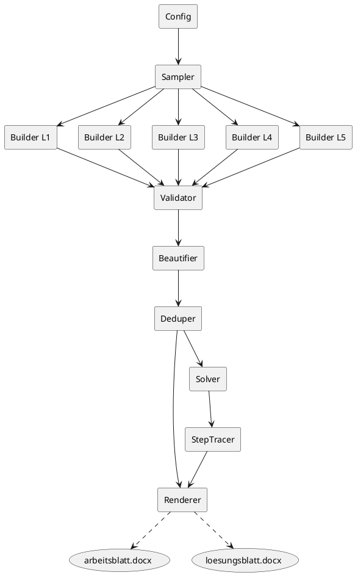

# SPEC-1-Gleichungs-Generator

## Background

Für Teilnehmende soll ein automatischer Generator lineare Gleichungen **mit genau einer Unbekannten x** erzeugen. Die Aufgaben decken einen **steigenden Schwierigkeitsgrad** ab – von einfachen Umformungen bis zu komplexen Bruchgleichungen. Ziel ist es, **lösbare**, teils **optisch unübersichtliche** Aufgaben zu erstellen, deren **Lösungen häufig als Brüche** enden. Zusätzlich wird ein **Arbeitsblatt (ohne Lösungen)** und ein **Lösungsblatt (mit Rechenweg)** als **.docx** ausgegeben.

## Requirements (MoSCoW)

### Must-have

* Nur **eine Variable x** pro Aufgabe; jede Gleichung **eindeutig lösbar** (keine Division durch 0, keine Widersprüche, keine Identitäten ohne eindeutige Lösung).
* **5 Schwierigkeitslevel**:

  1. **Einfach**: x nur auf **einer Seite** (z. B. `3x-7=12`, `5-2x=17`, `23=7+2x`).
  2. **Beide Seiten**: `ax+b = dx+e`.
  3. **Eine Klammer**: je 2× **+**, **–**, **×** vor der Klammer (× auch implizit).
  4. **Gemischte Klammern**: Kombinationen aus +/–/× und mehreren Klammern.
  5. **Bruchgleichungen**: von einfach (`(1/2)x=5`) bis schwer (verschachtelte Produkte/Quotienten).
* **Lösungen bevorzugt als Brüche** (kein Dezimalzwang); Rechenweg im Lösungsblatt **schrittweise** nachvollziehbar.
* **Word-Export**: Zwei Dateien `.docx`: Arbeitsblatt (Aufgaben, mit Leerraum), Lösungsblatt (nummerierte Lösungen + Rechenweg).
* **Sprache**: Deutsch (Aufgaben & Rechenwege).

### Should-have

* **Verteilung (Standard)**: L1=4, L2=4, L3=6, L4=4, L5=5 ⇒ **gesamt 23 Aufgaben**.
* **Parametrisierbare Anzahl** pro Level; globaler **Zufallssamen** (reprozierbare Sätze).
* **Bruchdarstellung** optional als **unechter Bruch** oder **gemischte Zahl**.
* **Genügend Abstand** zwischen Aufgaben (z. B. 4–6 leere Zeilen oder Absatzabstände in `docx`).

### Could-have

* Optionale **Seitenköpfe/‑füße** (Titel, Level-Abschnitte, Datum, Logo).
* Optionale **Aufgaben-IDs** oder QR-Code mit Lösungsschlüssel.

### Won’t-have (v1)

* Keine Nichtlinearitäten, keine Potenzen/Quadrate, keine Systeme.
* Kein PDF-Export (nur `.docx`).
* Keine grafischen Lösungshilfen.

## Method

### Numerische Leitplanken (≤ 120 überall) – Auftragsform

* **NL‑1 Globales Limit:** Stelle sicher, dass **in allen angezeigten Schritten** (Aufgabe und Rechenweg) **jede ganze Zahl**, **jeder Zähler/Nenner**, der **Hauptnenner (kgV)** sowie resultierende **Koeffizienten/Konstanten** **|Wert| ≤ 120** haben. Bei Verstoß: **verwerfen und neu sampeln**.
* **NL‑2 LCM‑Kontrolle:** Wähle Nenner so, dass **kgV ≤ 120**. Vor dem Akzeptieren der Aufgabe explizit das kgV der **gesamten Gleichung** prüfen. Keine Kombinationen zulassen, die kgV>120 erzeugen.
* **NL‑3 GCD‑Normalisierung:** Nach dem Beseitigen der Brüche und Sammeln zu `A·x + B = 0` **durch `gcd(|A|, |B|)` teilen**, sodass **|A|,|B| ≤ 120** und möglichst klein sind (ohne Lösung zu verändern).
* **NL‑4 Zwischenwerte prüfen:** Nach jedem StepTracer‑Schritt (Expand, Hauptnenner, Sammeln, Teilen) **alle sichtbaren Zahlen extrahieren** und auf **≤ 120** prüfen. Bei Überschreitung: Aufgabe **verwerfen**.
* **NL‑5 Erzeuger‑Rückkopplung:** Builder (v. a. L5) **skalieren** Parameter nach unten, wenn `A` oder `B` nach LCM‑Multiplikation > 120 wären. Bevorzugt **kleinere Zähler/Nenner** oder **weniger Summanden**.
* **NL‑6 Schwierigkeit ↔ Limit:** Bei aktivem D‑OPS (z. B. „großes kgV“) **an der Grenze planen** (z. B. kgV=120), aber sicherstellen, dass die nachfolgende Multiplikation **keine** Koeffizienten > 120 erzeugt (notfalls Vorfaktoren reduzieren).
* **NL‑7 Akzeptanzkriterien:** Max. **200 Resamples** pro Aufgabe; wenn Limit nicht einhaltbar, Aufgabe **überspringen** und nächste generieren (Gesamtanzahl trotzdem erfüllen).

### Architektur & Komponenten

* **Config**: Parameter (Anzahl pro Level, Zahlenbereiche, Ziel‑Bruchhäufigkeit, `visual_complexity`, Zufallssamen).
* **Sampler**: zieht eine Ziel‑Lösung r = p/q als Rationalzahl (bevorzugt Nicht‑Ganzzahl), um gezielt Aufgaben zu konstruieren, die auf x = r führen.
* **Builder L1…L5**: Vorlagen/Algorithmen je Level, die Terme so zusammensetzen, dass nach Vereinfachung eine lineare Gleichung entsteht und x = r die Lösung ist.
* **Validator**: prüft Eindeutigkeit (kein Koeffizient 0, keine Identität), Definitionsmenge (Nenner ≠ 0), kein Verbot schwacher Formen.
* **Beautifier**: setzt Formatpräferenzen (implizites Mal „2x“, Klammerstile, Minus vor Klammer). Gesteuert durch `visual_complexity` = "clean"|"mixed".
* **Solver + StepTracer**: löst mit SymPy und erzeugt Schritt‑für‑Schritt‑Rechenwege (Klammern auflösen → auf eine Seite bringen → zusammenfassen → durch Koeffizienten teilen; bei Brüchen zusätzlich Hauptnenner bilden, Ausschlusswerte nennen).
* **Deduper**: erkennt Duplikate per kanonischer Form (normalisierte Gleichung & Lösung) und verwirft Wiederholungen.
* **Renderer (DOCX)**: erstellt `arbeitsblatt.docx` (nur Aufgaben, mit Abstand) & `loesungsblatt.docx` (nummerierte Lösungen + Rechenweg).



### Datenmodell (Python‑Strukturen)

* `Equation`: `{ id, level, sympy_eq: Eq, text: str, solution: Rational, excluded: set, template: str, params: dict }`
* `SolveStep`: `{ description_de: str, lhs: Expr, rhs: Expr }`
* `Problem`: `{ equation: Equation, steps: List[SolveStep] }`

### Ziel‑Lösungs‑Sampler (Bruchfokus)

1. Ziehe zufällig p ∈ \[−12, 12] \ {0}, q ∈ \[2, 12].
2. Setze r = Rational(p, q). Mit Wahrscheinlichkeit α (z. B. 0.8) erzwinge Nicht‑Ganzzahl (falls q p teilt, neu ziehen).

### Builder‑Strategien (je Level)

**Level 1 (x auf einer Seite)**

* Muster: `ax + b = c` oder `a − bx = c` oder `c = d + ex`.
* Vorgehen: Ziehe a ≠ 0, b, c zufällig; erzwinge c = a·r + b (bzw. analog), damit Lösung r ist.
* Variation: Zufällig linke/rechte Seite vertauschen; Vorzeichen von a, b mischen.

**Level 2 (x auf beiden Seiten)**

* Muster: `ax + b = dx + e`.
* Ziehe a ≠ d für eindeutige Lösung.
* Setze z. B. b = d·r + e − a·r.
* Parameter a, d, e zufällig, dann b berechnen.
* Prüfe |a − d| nicht zu klein (zur Schrittvielfalt; optional Normierung auf positiven x‑Koeffizienten).

**Level 3 (eine Klammer)**

* Muster (+): `k + (mx + n) = px + q`.
* Muster (−): `k − (mx + n) = px + q`.
* Muster (× implizit): `t(mx + n) = px + q`.
* Vorgehen: Wähle k, m, n, t, p, q zufällig und erzwinge Gleichung so, dass x = r erfüllt ist (z. B. p·r + q = k + (m·r + n)).
* `visual_complexity="mixed"`: häufiger implizites Mal (`13(2x−7)`).

**Level 4 (gemischte Klammern)**

* Muster: `a(mx+n) + b − (cx+d) = p − (qx+r) + s(tx+u)`.
* Vorgehen: Werte beidseitig bei x = r gleichsetzen und dann eine Konstantenvariable (z. B. u) auflösen, damit die Bedingung exakt stimmt.
* Sicherstellen, dass nach Expandieren linear bleibt und x‑Koeffizient ≠ 0.

**Level 5 (Bruchgleichungen)**

* Einfach: `(a/b)·x = c` ⇒ r = (b·c)/a oder umgekehrt c = (a/b)·r.
* Mittel: `(ux+v)/w = y` oder Summe mehrerer Brüche mit Hauptnenner.
* Anspruchsvoll (lineare Bruchterme beidseitig):
  Konstruiere
  (a1·(m x + n) + c1) / (d1·(c x + d)) = (a2·(M x + N) + c2) / (d2·(C x + D))

  Kreuzmultiplizieren ergibt linear:
  d2·a1·(m x + n) + d2·c1 = d1·a2·(M x + N) + d1·c2.
  Wähle alle Parameter zufällig, löse nach einem (z. B. c2) so, dass x = r Lösung ist; prüfe Nenner ≠ 0 bei x = r und x‑Koeffizient ≠ 0.

### Validierung & Duplikatkontrolle

* Eindeutigkeit: Nach Expand/Collect muss Gleichung A·x + B = 0 mit A ≠ 0 ergeben.
* Domäne: Für alle Nennerterme Liste der Ausschlusswerte (z. B. 2x − 3 ≠ 0 ⇒ x ≠ 3/2).
* Bruchquote: Erzwinge Anteil β (z. B. 70–90 %) nicht‑ganzzahliger r; notfalls neu sampeln.
* Kanonische Form: `sympy.together() → expand() → collect(x) → Eq(lhs, rhs)`; String‑Hash in Set speichern.

### StepTracer (Rechenweg‑Heuristik)

1. Klammern auflösen (`expand`).
2. Brüche beseitigen: mit Hauptnenner multiplizieren; Ausschlusswerte explizit notieren.
3. x‑Terme auf eine Seite, Konstanten auf die andere.
4. Zusammenfassen (`collect(x)`), ggf. mit −1 multiplizieren, um führenden Koeffizienten positiv zu machen.
5. Durch Koeffizienten teilen und als Rational formatiert ausgeben; optional zusätzlich gemischte Zahl.

### DOCX‑Ausgabe

* **Arbeitsblatt**: Level‑Überschriften, dann nummerierte Aufgaben. Nach jeder Aufgabe Absatzabstand (z. B. 24–36 pt × 4–6 Zeilen) + optional Leerzeilen.
* **Lösungsblatt**: gleiche Nummerierung; unter jeder Aufgabe Schrittfolge als Liste.
* Typografie: Standard‑Schrift (z. B. Calibri 12), Monospace für Terme optional. Seitenränder 2–2.5 cm.

### Konfiguration (Beispiel)

```yaml
counts: { L1: 4, L2: 4, L3: 6, L4: 4, L5: 5 }
coeff_range: { min: -12, max: 12 }
denom_range: { min: 2, max: 12 }
prefer_fraction: 0.85   # Anteil nicht-ganzzahliger Lösungen
visual_complexity: mixed # oder "clean"
seed: 12345
format: { mixed_number: false }
```

## Implementation

### Stack & Installation

* **Python** ≥ 3.10
* **SymPy** (Algebra, Bruchformate)
* **Spire.Doc for Python (Free Edition)** für hochwertige **Word‑Gleichungen** via **MathML/OMML** – *keine lokale LaTeX‑Installation nötig*.
* Fallback (**ohne** Spire): `python-docx` mit **Unicode‑Mathe** (gut lesbar, aber nicht so hochwertig wie Word‑Equation).

```bash
pip install sympy spire.doc.free  # bevorzugt
# optionaler Fallback
pip install python-docx
```

> Hinweis: Free‑Edition Limit (Stand Hersteller): bis **500 Absätze** & **25 Tabellen** pro Datei – für Arbeits‑/Lösungsblatt reichlich.

### Konfiguration (voreingestellt nach deiner Vorgabe)

```python
CONFIG = {
    "seed": 12345,
    "counts": {"L1": 4, "L2": 4, "L3": 6, "L4": 4, "L5": 5},
    "coeff_range": (-12, 12),
    "denom_range": (2, 12),
    "prefer_fraction": 0.85,  # Anteil nicht-ganzzahliger Lösungen
    "visual_complexity": "mixed",  # <- deine Vorgabe
    "solutions": {"improper_and_mixed": True},  # <- beides anzeigen
    "backend": "spire",  # "spire" | "docx"
}
```

### Hauptskript (`gleichungs_generator.py`)

```python
from __future__ import annotations
import random
from dataclasses import dataclass
from typing import List, Tuple, Optional, Dict

from sympy import Eq, symbols, Rational, S, expand, collect, Poly
from sympy import lcm as sym_lcm
from sympy import fraction as sym_fraction
from sympy import together
from sympy.abc import x
from sympy.printing.mathml import mathml

# ———————————————————————————— Backend Auswahl (Spire bevorzugt) ————————————————————————————
BACKEND = "spire"
try:
    from spire.doc import Document, BuiltinStyle, HorizontalAlignment, Section, Paragraph, FileFormat, OfficeMath
except Exception:
    BACKEND = "docx"

if BACKEND == "docx":
    from docx import Document as DocxDocument
    from docx.shared import Pt

# ———————————————————————————— Datenstrukturen ————————————————————————————
@dataclass
class EquationItem:
    level: int
    lhs: S
    rhs: S
    solution: Rational
    text_template: str  # für Stringrendering, falls Fallback
    excluded: List[Rational]

@dataclass
class SolveStep:
    description: str
    eq: Eq

# ———————————————————————————— Helfer: Darstellung ————————————————————————————

def to_presentation_mathml(expr) -> str:
    """Erzeugt **Presentation MathML** (mit <math> Wrapper) für Word‑Gleichungen."""
    s = mathml(expr, printer="presentation")
    if not s.strip().startswith("<math"):
        s = f"<math xmlns='http://www.w3.org/1998/Math/MathML'>{s}</math>"
    return s

def rational_to_mixed(r: Rational) -> Tuple[int, Rational]:
    n = int(r)  # floor für positive & negative korrekt via SymPy
    frac = r - n
    return n, frac

# ———————————————————————————— Sampler für Ziel‑Lösung r ————————————————————————————

def sample_target_r(rng: random.Random, prefer_fraction=0.85, denom_range=(2,12)) -> Rational:
    while True:
        p = rng.randint(-12, 12)
        if p == 0:
            continue
        q = rng.randint(denom_range[0], denom_range[1])
        r = Rational(p, q)
        # Erzwinge mit hoher Wahrscheinlichkeit keine Ganzzahl
        if (abs(r.p) % abs(r.q) == 0) and (rng.random() < prefer_fraction):
            continue
        return r

# ———————————————————————————— Builder je Level ————————————————————————————

R = symbols('x')  # Alias, wir nutzen sympy.abc.x ohnehin


def build_L1(rng: random.Random, r: Rational) -> Tuple[S, S, str]:
    # Muster variieren
    mode = rng.choice(["ax_plus_b_eq_c", "a_minus_bx_eq_c", "c_eq_d_plus_ex"]) 
    a = rng.choice([i for i in range(-12,13) if i not in (0,)])
    b = rng.randint(-12, 12)
    c = a*r + b
    d = rng.randint(-12, 12)
    e = rng.choice([i for i in range(-12,13) if i not in (0,)])

    if mode == "ax_plus_b_eq_c":
        lhs, rhs = a*x + b, c
        tmpl = "ax + b = c"
    elif mode == "a_minus_bx_eq_c":
        lhs, rhs = a - b*x, a - b*r
        tmpl = "a − bx = c"
    else:
        lhs, rhs = c, d + e*x
        # q so bestimmen, dass c = d + e*r
        rhs = d + e*x
        d = c - e*r
        lhs, rhs = c, d + e*x
        tmpl = "c = d + ex"
    return lhs, rhs, tmpl


def build_L2(rng: random.Random, r: Rational) -> Tuple[S, S, str]:
    a = rng.choice([i for i in range(-12,13) if i != 0])
    d = rng.choice([i for i in range(-12,13) if i != a])  # a != d
    e = rng.randint(-12, 12)
    b = d*r + e - a*r
    lhs, rhs = a*x + b, d*x + e
    return lhs, rhs, "ax + b = dx + e"


def build_L3(rng: random.Random, r: Rational) -> Tuple[S, S, str]:
    variant = rng.choice(["plus", "minus", "times"])  # gemischt
    k = rng.randint(-12, 12)
    m = rng.choice([i for i in range(-12,13) if i != 0])
    n = rng.randint(-12, 12)
    p = rng.choice([i for i in range(-12,13)])

    if variant == "plus":
        # k + (mx + n) = px + q  -> q so, dass r Lösung ist; m != p sichern
        p = rng.choice([i for i in range(-12,13) if i != m])
        q = k + (m*r + n) - p*r
        lhs, rhs = k + (m*x + n), p*x + q
        tmpl = "k + (mx + n) = px + q"
    elif variant == "minus":
        p = rng.choice([i for i in range(-12,13) if i != -m])
        q = k - (m*r + n) - p*r
        lhs, rhs = k - (m*x + n), p*x + q
        tmpl = "k − (mx + n) = px + q"
    else:
        t = rng.choice([i for i in range(-12,13) if i not in (0,)])
        p = rng.choice([i for i in range(-12,13) if i != t*m])
        q = t*(m*r + n) - p*r
        lhs, rhs = t*(m*x + n), p*x + q
        tmpl = "t(mx + n) = px + q"
    return lhs, rhs, tmpl


def build_L4(rng: random.Random, r: Rational) -> Tuple[S, S, str]:
    # a(mx+n) + b − (cx+d) = p − (qx+r2) + s(tx+u)
    a = rng.choice([i for i in range(-6,7) if i != 0])
    m = rng.choice([i for i in range(-6,7) if i != 0])
    n = rng.randint(-10, 10)
    b = rng.randint(-10, 10)
    c = rng.choice([i for i in range(-6,7)])
    d = rng.randint(-10, 10)
    p = rng.randint(-10, 10)
    q = rng.choice([i for i in range(-6,7)])
    s = rng.choice([i for i in range(-6,7) if i != 0])
    t = rng.choice([i for i in range(-6,7)])
    # Steigungen prüfen: LHS slope = a*m - c ; RHS slope = -(q) + s*t ; nicht gleich
    while a*m - c == (-q + s*t):
        q = rng.choice([i for i in range(-6,7)])
        s = rng.choice([i for i in range(-6,7) if i != 0])
        t = rng.choice([i for i in range(-6,7)])

    # u so bestimmen, dass Gleichheit bei x=r gilt
    left_at_r = a*(m*r + n) + b - (c*r + d)
    right_wo_u_at_r = p - (q*r + Rational(0)) + s*(t*r)
    # s*(t*r + u) = s*t*r + s*u  -> u = (left_at_r - (p - (q*r) + s*t*r)) / s
    u = (left_at_r - (p - (q*r) + s*t*r)) / s

    lhs = a*(m*x + n) + b - (c*x + d)
    rhs = p - (q*x + 0) + s*(t*x + u)
    tmpl = "a(mx+n) + b − (cx+d) = p − (qx+r) + s(tx+u)"
    return lhs, rhs, tmpl


def build_L5(rng: random.Random, r: Rational) -> Tuple[S, S, str]:
    variant = rng.choice(["simple_frac", "two_fracs", "cross_frac"])  # Vielfalt
    if variant == "simple_frac":
        # (a/b) x = c  -> a/b * r = c
        a = rng.choice([i for i in range(2, 12)])
        b = rng.choice([i for i in range(2, 12)])
        c = Rational(a, b) * r
        lhs, rhs = Rational(a, b) * x, c
        tmpl = "(a/b)x = c"
    elif variant == "two_fracs":
        # (u x + v)/w + (p x + q)/s = t
        u = rng.choice([i for i in range(-6,7) if i != 0])
        v = rng.randint(-10, 10)
        w = rng.choice([i for i in range(2, 12)])
        p = rng.choice([i for i in range(-6,7)])
        q = rng.randint(-10, 10)
        s = rng.choice([i for i in range(2, 12)])
        t = Rational(rng.randint(-10, 10), rng.choice([2,3,4,5,6,7,8,9,10,11,12]))
        # Stelle v so ein, dass Gleichung bei r gilt
        left_other = u*r/w + p*r/s + q/s
        v = w*(t - left_other)
        lhs = (u*x + v)/w + (p*x + q)/s
        rhs = t
        tmpl = "(ux+v)/w + (px+q)/s = t"
    else:
        # anspruchsvoller:  (a1( m x + n))/(-2( c1 x + d1)) = ( (A( M x + N)) )/((-6)( C1 x + D1))
        a1 = rng.choice([i for i in range(2, 7)])
        m = rng.choice([i for i in range(-4,5) if i != 0])
        n = rng.randint(-8, 8)
        c1 = rng.choice([i for i in range(-4,5)])
        d1 = rng.randint(-8, 8)
        A = rng.choice([i for i in range(2, 7)])
        M = rng.choice([i for i in range(-4,5)])
        N = rng.randint(-8, 8)
        C1 = rng.choice([i for i in range(-4,5)])
        D1 = rng.randint(-8, 8)
        # Wir formen: LHS = a1*(m x + n)/(-2*(c1 x + d1)) ; RHS = A*(M x + N)/(-6*(C1 x + D1))
        lhs = a1*(m*x + n)/(-2*(c1*x + d1))
        # Wähle N so, dass bei r Gleichheit gilt
        rhs_wo_N = A*(M*r)/(-6*(C1*r + D1))
        target = lhs.subs(x, r)
        # A*(M*r + N)/(-6*(C1*r + D1)) = target ⇒ N = (-6*(C1*r + D1)*target)/A - M*r
        denom = -6*(C1*r + D1)
        if denom == 0:
            D1 += 1  # simple rescue
            denom = -6*(C1*r + D1)
        N = (denom*target)/A - M*r
        rhs = A*(M*x + N)/(-6*(C1*x + D1))
        tmpl = "a1( mx + n)/(-2( c1 x + d1)) = A( M x + N)/((-6)( C1 x + D1))"
    return lhs, rhs, tmpl

# ———————————————————————————— Validator & Domäne ————————————————————————————

def excluded_values(expr) -> List[Rational]:
    # Finde x-Werte, die Nenner zu 0 machen (einfach: lineare Faktoren)
    ex = []
    for side in [expr.lhs, expr.rhs]:
        num, den = sym_fraction(together(side))
        den = expand(den)
        # lineare Faktoren ax + b -> x != -b/a
        if den.has(x):
            poly = Poly(den, x)
            if poly.degree() == 1:
                a = poly.coeffs()[0]
                b = poly.coeffs()[1] if len(poly.coeffs())>1 else 0
                ex.append(Rational(-b, a))
    return ex


def is_unique_linear(eq: Eq) -> bool:
    expr = expand(together(eq.lhs - eq.rhs))
    poly = Poly(expr, x)
    return poly.degree() == 1 and poly.coeffs()[0] != 0

# ———————————————————————————— StepTracer (kompakt & robust) ————————————————————————————

def trace_steps(eq: Eq) -> List[SolveStep]:
    steps: List[SolveStep] = []
    steps.append(SolveStep("Ausgangsgleichung", eq))

    # 1) Klammern auflösen
    lhs1, rhs1 = expand(eq.lhs), expand(eq.rhs)
    if (lhs1 != eq.lhs) or (rhs1 != eq.rhs):
        steps.append(SolveStep("Klammern auflösen", Eq(lhs1, rhs1)))
    else:
        lhs1, rhs1 = eq.lhs, eq.rhs

    # 2) Brüche beseitigen (Hauptnenner)
    numL, denL = sym_fraction(together(lhs1))
    numR, denR = sym_fraction(together(rhs1))
    l = sym_lcm(denL, denR)
    if l != 1:
        lhs2, rhs2 = expand(numL*l/denL), expand(numR*l/denR)
        steps.append(SolveStep(f"Mit dem Hauptnenner {l} multiplizieren", Eq(lhs2, rhs2)))
    else:
        lhs2, rhs2 = lhs1, rhs1

    # 3) Alles auf eine Seite
    expr = expand(lhs2 - rhs2)
    steps.append(SolveStep("Alle Terme auf eine Seite bringen", Eq(expr, 0)))

    # 4) Sammeln nach x
    expr_c = collect(expr, x)
    steps.append(SolveStep("Nach x zusammenfassen", Eq(expr_c, 0)))

    # 5) Lösen: Ax + B = 0 ⇒ x = -B/A
    poly = Poly(expr_c, x)
    A = poly.coeffs()[0]
    B = poly.all_coeffs()[1] if len(poly.all_coeffs())>1 else 0
    steps.append(SolveStep("Durch den Koeffizienten teilen", Eq(x, -Rational(B, A))))

    return steps

# ———————————————————————————— Generator je Level ————————————————————————————

def generate_level(rng: random.Random, level: int, count: int, prefer_fraction: float) -> List[EquationItem]:
    items: List[EquationItem] = []
    while len(items) < count:
        r = sample_target_r(rng, prefer_fraction=prefer_fraction)
        if level == 1:
            lhs, rhs, tmpl = build_L1(rng, r)
        elif level == 2:
            lhs, rhs, tmpl = build_L2(rng, r)
        elif level == 3:
            lhs, rhs, tmpl = build_L3(rng, r)
        elif level == 4:
            lhs, rhs, tmpl = build_L4(rng, r)
        else:
            lhs, rhs, tmpl = build_L5(rng, r)
        eq = Eq(lhs, rhs)
        # Validierung
        if not is_unique_linear(eq):
            continue
        ex = excluded_values(eq)
        if any(r == e for e in ex):  # Lösung darf nicht ausgeschlossen sein
            continue
        items.append(EquationItem(level, lhs, rhs, r, tmpl, ex))
    return items

# ———————————————————————————— Rendering: DOCX (Spire bevorzugt) ————————————————————————————

def render_spire(sets: Dict[int, List[EquationItem]], out_tasks="arbeitsblatt.docx", out_solutions="loesungsblatt.docx", show_mixed=True):
    # Arbeitsblatt
    doc = Document()
    sec = doc.AddSection()
    title = sec.AddParagraph(); title.AppendText("Gleichungs-Generator – Arbeitsblatt"); title.ApplyStyle(BuiltinStyle.Heading1); title.Format.HorizontalAlignment = HorizontalAlignment.Center

    idx = 1
    for lvl in sorted(sets.keys()):
        p = sec.AddParagraph(); p.AppendText(f"Level {lvl}"); p.ApplyStyle(BuiltinStyle.Heading2)
        for item in sets[lvl]:
            eq_mml = to_presentation_mathml(Eq(item.lhs, item.rhs))
            para = sec.AddParagraph()
            math = OfficeMath(doc)
            math.FromMathMLCode(eq_mml)
            para.Items.Add(math)
            # Abstand für Rechenraum
            sec.AddParagraph(); sec.AddParagraph(); sec.AddParagraph()
            idx += 1
    doc.SaveToFile(out_tasks, FileFormat.Docx2016)

    # Lösungsblatt
    doc2 = Document()
    sec2 = doc2.AddSection()
    t2 = sec2.AddParagraph(); t2.AppendText("Gleichungs-Generator – Lösungsblatt"); t2.ApplyStyle(BuiltinStyle.Heading1); t2.Format.HorizontalAlignment = HorizontalAlignment.Center

    idx = 1
    for lvl in sorted(sets.keys()):
        p = sec2.AddParagraph(); p.AppendText(f"Level {lvl}"); p.ApplyStyle(BuiltinStyle.Heading2)
        for item in sets[lvl]:
            # Überschrift Aufgabe
            hdr = sec2.AddParagraph(); hdr.AppendText(f"Aufgabe {idx}") ; hdr.ApplyStyle(BuiltinStyle.Heading3)
            # Ausschlusswerte (falls vorhanden)
            if item.excluded:
                excl_text = ", ".join([f"x ≠ {e}" for e in item.excluded])
                sec2.AddParagraph().AppendText(f"Definitionsmenge: {excl_text}")
            # Schritte
            for step in trace_steps(Eq(item.lhs, item.rhs)):
                # Beschreibung
                sec2.AddParagraph().AppendText(step.description)
                # Gleichung als MathML
                mml = to_presentation_mathml(step.eq)
                para = sec2.AddParagraph(); 
                math = OfficeMath(doc2)
                math.FromMathMLCode(mml)
                para.Items.Add(math)
            # Ergebnis in zwei Formen
            sol = item.solution
            n, frac = rational_to_mixed(sol)
            mixed_str = f"{n} {frac}" if frac != 0 else f"{n}"
            line = sec2.AddParagraph(); line.AppendText(f"Lösung: x = {sol}  (gemischt: {mixed_str})")
            sec2.AddParagraph()
            idx += 1
    doc2.SaveToFile(out_solutions, FileFormat.Docx2016)


def render_docx_fallback(sets: Dict[int, List[EquationItem]], out_tasks="arbeitsblatt.docx", out_solutions="loesungsblatt.docx"):
    # Einfaches Text‑Layout mit Unicode‑Brüchen
    d = DocxDocument()
    d.add_heading("Gleichungs-Generator – Arbeitsblatt", 0)
    for lvl in sorted(sets.keys()):
        d.add_heading(f"Level {lvl}", 1)
        for item in sets[lvl]:
            d.add_paragraph(str(Eq(item.lhs, item.rhs)))
            d.add_paragraph("") ; d.add_paragraph("") ; d.add_paragraph("")
    d.save(out_tasks)

    d2 = DocxDocument()
    d2.add_heading("Gleichungs-Generator – Lösungsblatt", 0)
    idx = 1
    for lvl in sorted(sets.keys()):
        d2.add_heading(f"Level {lvl}", 1)
        for item in sets[lvl]:
            d2.add_heading(f"Aufgabe {idx}", 2)
            if item.excluded:
                excl_text = ", ".join([f"x ≠ {e}" for e in item.excluded])
                d2.add_paragraph(f"Definitionsmenge: {excl_text}")
            for step in trace_steps(Eq(item.lhs, item.rhs)):
                d2.add_paragraph(step.description)
                d2.add_paragraph(str(step.eq))
            sol = item.solution
            n, frac = rational_to_mixed(sol)
            mixed_str = f"{n} {frac}" if frac != 0 else f"{n}"
            d2.add_paragraph(f"Lösung: x = {sol}  (gemischt: {mixed_str})")
            idx += 1
    d2.save(out_solutions)

# ———————————————————————————— Orchestrierung ————————————————————————————

def main(config: dict):
    rng = random.Random(config.get("seed", 12345))
    counts = config["counts"]
    prefer_fraction = config.get("prefer_fraction", 0.85)

    sets: Dict[int, List[EquationItem]] = {}
    for lvl, cnt in [(1, counts["L1"]), (2, counts["L2"]), (3, counts["L3"]), (4, counts["L4"]), (5, counts["L5"])]:
        sets[lvl] = generate_level(rng, lvl, cnt, prefer_fraction)

    backend = config.get("backend", "spire") if BACKEND == "spire" else "docx"
    if backend == "spire":
        render_spire(sets)
    else:
        render_docx_fallback(sets)

if __name__ == "__main__":
    CONFIG = {
        "seed": 12345,
        "counts": {"L1": 4, "L2": 4, "L3": 6, "L4": 4, "L5": 5},
        "prefer_fraction": 0.85,
        "visual_complexity": "mixed",
        "solutions": {"improper_and_mixed": True},
        "backend": "spire",
    }
    main(CONFIG)
```

### Hinweise zur Qualität der Darstellung

* Mit **Spire.Doc** werden Gleichungen als **native Word‑Equations (OMML/MathML)** eingefügt – Darstellung „wie in LaTeX“, **ohne** LaTeX‑Installation.
* Das Fallback mit `python-docx` ist bewusst schlicht (Monotext). Für Unterrichtsmaterial empfehle ich den **Spire‑Weg**.

### Nächster Schritt

Wenn du magst, ergänze ich noch **Milestones** & **Gathering Results** (QS‑Kriterien) – und passe ggf. Zahlenbereiche/Anzahl je Level an.

## Difficulty‑Aufträge (ohne Code) – zur Implementierung der 25 Ideen

> **Ziel:** Die folgenden Aufträge sind **Befehls‑Prompts** für den Generator. Sie erhöhen die Schwierigkeit **ohne** die Linearität zu verletzen und respektieren die Zahlengrenzen.

### Globale Nebenbedingungen (GN)

* **GN‑1 Zahlenobergrenze:** In **Aufgaben** (sichtbarer Text) dürfen **alle** ganzen Zahlen, Zähler, Nenner sowie der **Hauptnenner (kgV)** je Gleichung **≤ 120** sein (Betrag). Wird durch Umformung/Straffung ein Wert > 120 sichtbar, **verwerfe** und **resample** die Gleichung.
* **GN‑2 Nenner/LCM:** Wähle Nenner so, dass das **kgV aller Nenner pro Gleichung ≤ 120** ist. **Kombinationen** prüfen; z. B. 11 & 12 **nicht** kombinieren (LCM 132), 7 & 15 **ok** (LCM 105).
* **GN‑3 Linearität & Eindeutigkeit:** Jede Gleichung ist nach Expand/Together/Collect **vom Grad 1** mit **genau einer Lösung**. **Ausschlusswerte** (lineare Nenner = 0) **dokumentieren** und **≠ Lösung**.
* **GN‑4 Darstellung:** Standard **visual\_complexity = "mixed"** (implizites Mal, Minusklammern). **Keine Dezimalzahlen** in Aufgaben; **Brüche** bevorzugen.
* **GN‑5 Ziel‑Lösung:** Ziehe gezielt **Nicht‑Ganzzahl‑Lösungen** (Rational), bevorzugt „unschöne“ Brüche; achte, dass Zähler/Nenner **≤ 120** bleiben.

### Schwierigkeitstreiber als Aufträge (D‑OPS)

1. **D‑OPS‑1 Knapp unterschiedliche Steigungen:** Erzeuge Gleichungen mit **kleinem Δ** der x‑Koeffizienten (|a−d| ∈ {1,2}). Beispielstruktur: `ax+b = dx+e`. **Grenzwerte prüfen** (alle Zahlen ≤ 120).
2. **D‑OPS‑2 Unschöne Primfaktoren:** Bevorzuge Faktoren aus {7,11,13,17,19} in **Zählern/Koeffizienten**, **ohne** LCM>120 zu erzeugen.
3. **D‑OPS‑3 Viele Summanden:** Platziere **5–7 Terme pro Seite** (nur linear). Sicherstellen, dass nach Vereinfachung **Zahlen ≤ 120** bleiben.
4. **D‑OPS‑4 Verteilte Minusklammern mehrfach:** Setze **mind. zwei** Ausdrücke der Form `−(mx+n)` pro Gleichung.
5. **D‑OPS‑5 Implizites Mal:** Nutze **häufig** implizites Produkt vor Klammern: `k(mx+n)`; **kein** `·` Zeichen.
6. **D‑OPS‑6 Konstante + Klammer gemischt:** Kombiniere `k + (mx+n) − t(x+u)` auf **einer oder beiden Seiten**.
7. **D‑OPS‑7 Großes, aber zulässiges kgV:** Wähle Nenner‑Mengen mit **kgV nahe 120** (z. B. {8, 3, 5}→120), **aber ≤ 120**. 9/16/25 **nur** allein oder so, dass **kgV ≤ 120** bleibt.
8. **D‑OPS‑8 Minus im Bruch variieren:** Erzeuge Varianten mit Minus im **Zähler**, im **Nenner** oder **vor** dem Bruch; gleiche Zahlengrenzen prüfen.
9. **D‑OPS‑9 Gemischte Zahlen als Konstanten:** Verwende **gemischte Zahlen** auf einer Seite (z. B. `4 2/5`), intern als **unechter Bruch** modellieren.
10. **D‑OPS‑10 „Fast kürzbar“:** Konstruiere Paare, die **zum falschen Kürzen verleiten**, ohne echte x‑Kürzung zuzulassen.
11. **D‑OPS‑11 Beinahe‑Identische Klammern beidseitig:** Nutze die **gleiche Klammer** auf beiden Seiten, aber mit **kleiner Konstante** Unterschied.
12. **D‑OPS‑12 Unauffällige Nullen:** Baue Summanden ein, die sich **zu 0** addieren (z. B. `(4−5)+(3−3)`), ohne die Zahlenobergrenze zu reißen.
13. **D‑OPS‑13 Versteckte ±1‑Faktoren:** Setze Faktoren **1** oder **−1** vor Klammern mehrfach ein.
14. **D‑OPS‑14 Asymmetrische Schreibweise:** Vertausche Ordnungen (`−7+3x` statt `3x−7`), mische **Position** der Konstanten.
15. **D‑OPS‑15 Konstanten als Brüche summieren:** Streue mehrere **reine Brüche** mit verschiedenen Nennern (kgV ≤ 120) ein.
16. **D‑OPS‑16 „Hässliche“ Ziel‑Brüche:** Erzwinge Lösungen wie **−23/17**, **19/14**; Zähler/Nenner **≤ 120**.
17. **D‑OPS‑17 Lineare Klammerkaskaden:** Kette **≥3** Klammerausdrücke linear mit gemischten Vorzeichen.
18. **D‑OPS‑18 Konfligierende Vorzeichen in Klammern:** Nutze Klammern mit **negierten** x‑ und Konstantenteilen: `2(−3x+5) − (−x−4)`.
19. **D‑OPS‑19 Einseitiger Bruch vs. viele Summanden:** Setze **eine** Bruchseite gegen **viele** lineare Summanden auf der anderen.
20. **D‑OPS‑20 Ein Bruch pro Seite (beidseitig):** Erzeuge je **einen** linearen Bruchterm pro Seite, LCM‑Check **≤ 120**; strikt linear.
21. **D‑OPS‑21 Beinahe‑Symmetrie:** Nutze gleiche Struktur plus kleinen Zusatzterm `+e x` (|e| klein, ≠0). Zahlenobergrenze prüfen.
22. **D‑OPS‑22 Spätes Kürzen:** Wähle Zahlen so, dass nach Hauptnenner‑Multiplikation **große, aber ≤ 120** Faktoren entstehen, die **erst spät** kürzen.
23. **D‑OPS‑23 Domain‑Ausschlüsse betonen:** Erzwinge lineare Nenner, gib **Definitionsmenge** aus (`x ≠ a/b`), Lösung **nicht** ausgeschlossen.
24. **D‑OPS‑24 Erzwungene Zwischennegative:** Baue Zwischenschritte mit **negativem** Leitkoeffizienten ein; späteres Multiplizieren mit **−1** erforderlich.
25. **D‑OPS‑25 Kleine Δ‑Steigung + großes (zulässiges) kgV:** **Kombiniere** D‑OPS‑1 mit D‑OPS‑7, beachte **LCM ≤ 120**.

### Konfliktregeln & Reihenfolge

* Prüfe **zuerst** GN‑2 (kgV), **dann** GN‑1 (Zahlenobergrenze) auf der **final formatierten Aufgabe**. Bei Verstoß: **resample** betroffene Parameter.
* Wenn mehrere D‑OPS gewählt sind, **max. 3 pro Aufgabe** kombinieren; Priorität: {1,7,20} > {3,4,5,6,17,24} > übrige.
* **Duplikate** vermeiden: kanonische Normalform hashen (collect(x)).

### Darstellung im Lösungsblatt

* Zeige **zwei Formate** der Lösung: **unechter Bruch** **und** **gemischte Zahl**. Keine Dezimaldarstellung. Notiere **Definitionsmengen** klar.

## Streamlit GUI (offline, Single‑User)

### Zielbild

Eine **lokale** Streamlit‑App (ohne Internetzugriff) für **Einzelperson‑Nutzung** zur Erzeugung von Arbeits‑ und Lösungsblättern als **DOCX**, gesteuert über Komfort‑UI. Keine Telemetrie, keine externen CDNs. Vorschau ohne Online‑LaTeX.

### Seiten & Navigationsfluss

1. [x] **Start** – Kurzbeschreibung, Button „Neuen Satz generieren“.
2. [x] **Einstellungen** – Alle Generator‑Parameter: Level‑Anzahlen, Zufallssamen, Bruchquote, Numerische Leitplanken (≤ 120), Auswahl der **Difficulty‑Aufträge (D‑OPS)**, Darstellung (visual\_complexity), Ausgabeoptionen.
3. [x] **Vorschau** – Liste der generierten Aufgaben (Text/Unicode‑Math), wahlweise auch ausgewählte **Lösungsschritte** je Aufgabe ein-/ausblendbar; Ampel‑Checks (LCM≤120, Zahlen≤120, Eindeutigkeit).
4. [x] **Export** – Dateinamen/Pfade, Buttons „Arbeitsblatt.docx erzeugen“ / „Lösungsblatt.docx erzeugen“, Zusammenfassung (Anzahl Aufgaben, D‑OPS‑Verteilung), Log‑Panel.
5. [x] **Protokoll** – Übersichtsseite mit Validierungs‑Hinweisen, Ausschlusswerten und ggf. Resampling‑Zählern pro Aufgabe.

### UI‑Bausteine (Seite „Einstellungen“)

* **Konfiguration**

  * [x] Seed (Number Input)
  * [x] Anzahl je Level (Sliders L1..L5)
  * [x] Bruchquote *prefer\_fraction* (Slider 0.5–0.95)
  * [x] Darstellung: `visual_complexity` (Select: *mixed*, *clean*)
* **Numerische Leitplanken (≤ 120)**

  * [x] Checkbox „Limit strikt erzwingen (alle Schritte)“ (Default **an**)
  * [x] Info‑Badge: Erklärung kgV‑Grenze (≤ 120) und automatisches Resampling
  * [x] Max. Resamples pro Aufgabe (Number Input, Default 200)
* **Difficulty‑Aufträge (D‑OPS)**

  * [x] Multi‑Select der 25 Ideen (Tooltips mit Kurzbeschreibung)
  * [x] Max. Kombinationen pro Aufgabe (Select: 1–3; Default 3)
  * [x] Prioritätsregel fest: {1,7,20} > {3,4,5,6,17,24} > Rest (readonly Hinweis)
* **Bruch‑/Ausgabe‑Optionen**

  * [x] Lösungen im Lösungsblatt: „Unechter Bruch **und** gemischte Zahl“ (fest eingestellt)
  * [x] Dezimaldarstellung: ausgeschaltet (readonly Hinweis)
* **Dateien**

  * [x] Ausgabeverzeichnis (Folder Picker)
  * [x] Dateinamen (Text Inputs): `arbeitsblatt.docx`, `loesungsblatt.docx`
* **Aktion**

  * [x] Primärbutton „Aufgabenset generieren“

### Vorschau ohne Internet

* **Rendering‑Modi** (umschaltbar):

  1. [x] *Unicode‑Pretty*: SymPy‑Pretty‑Print (Monospace), zuverlässig offline.
  2. [x] *PNG‑Schnappschuss*: Gleichungen als gerenderter Monotext in Bild (zur besseren Lesbarkeit, weiterhin offline).
* [x] Hinweis: Keine LaTeX/MJX‑CDN‑Nutzung. Word‑Formeln (OMML) werden **nur** im Export erzeugt.

### Validierung & QA in der UI

* Nach Generierung zeigt die Vorschau je Aufgabe **Badges**:

  * [x] **Linearität** (Grad 1), **Eindeutige Lösung**, **LCM≤120**, **Zahlengrenze≤120**.
* [x] Tooltip „Warum nicht akzeptiert?“ mit konkretem Prüfpunkt (z. B. kgV=132 → verworfen, resampled 3×).
* [x] Zusammenfassungs‑Karte: Anzahl akzeptierter Aufgaben, durchschnittliche Resamples, D‑OPS‑Häufigkeiten.

### Zustand & Persistenz

* [x] `st.session_state` Schlüssel: `config`, `problems`, `preview_mode`, `logs`, `seed_used`.
* [x] Button „Konfiguration als JSON speichern/laden“ (lokal), um Sätze reproduzierbar zu erzeugen.

### Offline‑Betrieb

* [x] **Keine** externen CSS/JS/Fonts. Streamlit‑Telemetry deaktiviert: `browser.gatherUsageStats: false` in `.streamlit/config.toml`.
* [x] Start im Offline‑Modus: `streamlit run app.py` (ohne Netzwerk erforderlich). App öffnet lokalen Browser auf `localhost`.

### Fehlerfälle & UX

* [x] Wenn Zielanzahl nicht erreicht wird (wegen Limits): Hinweis‑Panel mit „Nächster Versuch“ Button (erneut generieren mit neuem Seed) und Liste der häufigsten Ablehnungsgründe.
* [x] Export‑Toast nach Erfolg mit Pfadangabe. Bei Schreibfehlern (z. B. Pfad) klarer Fehlerhinweis.

### Sicherheitsgeländer

* [x] Single‑User: Keine Uploads ins Netz, keine API‑Keys. Nur lokales Dateisystem.
* [x] Max. Aufgabenanzahl hart limitiert (z. B. 200) um Hänger durch massives Resampling zu vermeiden.

### Testideen (manuell in der GUI)

* [x] Seeds testen (Reproduzierbarkeit).
* [x] D‑OPS‑Kombinationen 1/7/20 forcieren und prüfen, dass **kgV ≤ 120** bleibt.
* [x] Vorschau‑Modi vergleichen (Unicode vs. PNG).
* [x] DOCX öffnen und Formelqualität (OMML) verifizieren; Lösungen doppelt (unecht + gemischt) prüfen.
